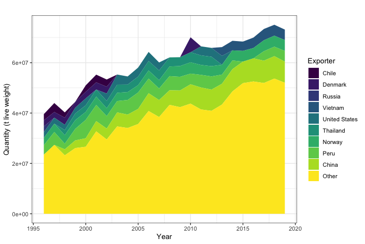

# exploreARTIS

Visualize and summarize ARTIS data. ARTIS data consists of:

- exporter_iso3c (string): Exporter Country ISO 3 code
- importer_iso3c (string): Importer Country ISO 3 code
- source_country_iso3c (string): Producer Country ISO 3 code
- dom_source (string): Domestic Export / Foreign Export / Error Export
- hs6 (string): 6-digit HS commodity code
- sciname (string): Species or Species group
- environment (string): Marine / Freshwater
- method (string): Capture / Aquaculture / Unknown
- product_weight_t (double): Product weight (tonnes)
- live_weight_t (double): Live weight (tonnes)
- hs_version (string): version of HS codes
- year (double): Year
- snet_est (string): Maximum / Midpoint / Minimum estimate for domestic export and foreign export calculation

## Installation

### Setup
**Mac Users** Run the following commands in terminal:
```bash
brew install pkg-config
brew install gdal
```
Once installed run the following command in the R console:
```r
install.packages("sf", configure.args = "--with-proj-lib=/usr/local/lib/")
```

**Windows Users** Please make sure you have Rtools installed first. Follow the instructions [here](https://cran.r-project.org/bin/windows/Rtools/). Then run the following command in the R console:
```r
install.packages("sf")
```

### exploreARTIS Package installation
You can install this package with the devtools package. The first time you do it you will have to run 
```r 
install.packages("devtools")
library(devtools)
```

Then, you can run 
```r 
devtools::install_github("Seafood-Globalization-Lab/exploreARTIS", dependencies = TRUE)
```

After you install the exploreARTIS package, you can just load it with library(exploreARTIS). You will also need to reinstall the package whenever there are updates to the package code.

## Examples

Here are examples of all the types of plots that can be created with this package. (Assume that "artis" in this example is a variable that contains an artis dataset)

### Analyzing volumes

```r
# loading library
library(exploreARTIS)

# Bar chart visualizing seafood trade volumes by exporter
plot_bar(artis, bar_group = "exporter_iso3c")
```


```r
# loading library
library(exploreARTIS)

# Bar chart visualizing seafood trade volumes by exporter and filling by export source
plot_bar(artis, bar_group = "exporter_iso3c", fill_type = "dom_source")
```


### Analyzing trade partners
**Note:** you can visualize exporters and importers with the following functions. Adjust the trade_flow input variable accordingly from trade_flow = "export", to trade_flow = "import"

A line graph of all export partners in the ARTIS dataset
```r
# loading library
library(exploreARTIS)

plot_partner_line(artis, trade_flow = "export")
```


A stacked line graph of all export partners in the ARTIS dataset
```r
# loading library
library(exploreARTIS)

plot_partner_stacked(artis, trade_flow = "export")
```


### Analyzing Species Trends
```r
# loading library
library(exploreARTIS)

plot_species_line(artis, plot.title = "Species Trends 1995 - 2019")
```


```r
# loading library
library(exploreARTIS)

plot_species_stacked(artis)
```


### Visualizing Trade Networks

Sankey Plots - This is a great way to visualize the seafood trade supply chain.
```r
# loading library
library(exploreARTIS)

# Sankey plot of all seafood trade
plot_sankey(artis)

```


Chord Diagrams - This is a great way to visualize export and import trade flows.
```r
# loading library
library(exploreARTIS)

# Chord diagram of all seafood trade
plot_chord(artis)
```


Map - This is a great way to visualize trade flows.
```r
# loading library
library(exploreARTIS)

# Map of seafood exports from Chile
plot_map(artis, exporters = "CHL", country_fill = "import", flow_arrows = TRUE)
```


## More advanced examples

```r
# loading libraries
library(exploreARTIS)

# Sankey plot of seafood produced by Chile
# Note we used the ISO 3 code, CHL, for Chile rather than its full country name
plot_sankey(artis, producers = c("CHL"))
```


```r
# loading libraries
library(tidyverse)
library(exploreARTIS)

# Sankey plot of Atlantic Salmon trade
# Note we used the the scientific name "salmo salar" for Atlantic Salmon rather than its common name
plot_sankey(artis, species= c("salmo salar"))
```


# artis-exchange-planning
