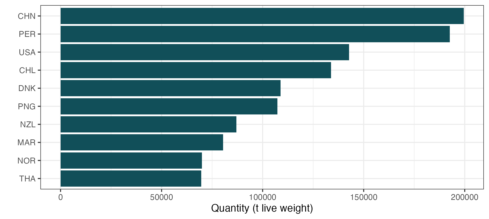
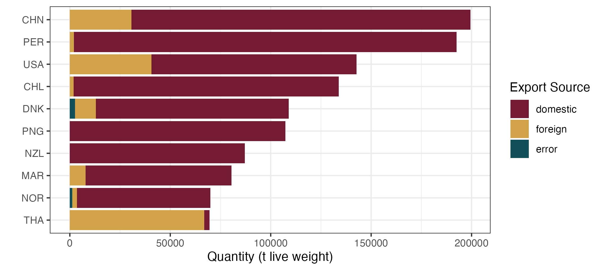
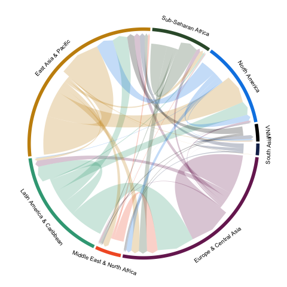
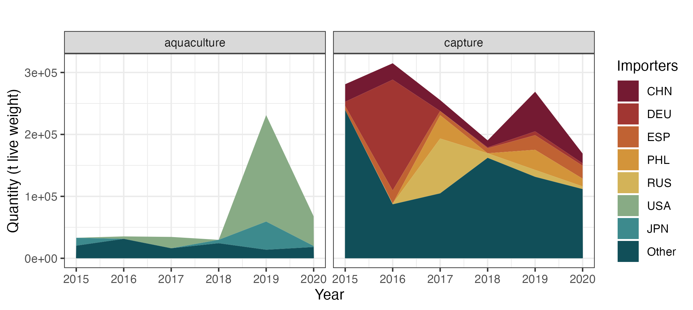
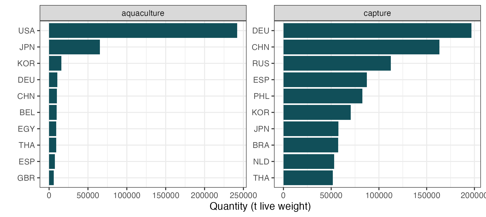

# exploreARTIS

The `exploreARTIS` R package provides functions for filtering and visualizing trade and consumption data from the ARTIS (Aquatic Resource Trade In Species) database. This package is designed to facilitate and streamline investigation of the ARTIS database. Most functions are wrappers for `ggplot2::ggplot()` and can accept additional layers to further customize the figures, with the exception of `exploreARTIS::plot_sankey()` which is based on `ggsankey`. 

## Installation

### Setup
**Mac Users** Run the following commands in terminal:
```bash
brew install pkg-config
brew install gdal
```
Once installed run the following command in the R console:
```r
install.packages("sf", configure.args = "--with-proj-lib=/usr/local/lib/")
```

**Windows Users** Please make sure you have Rtools installed first. Follow the instructions [here](https://cran.r-project.org/bin/windows/Rtools/). Then run the following command in the R console:
```r
install.packages("sf")
```

### exploreARTIS Package installation
You can install this package with the devtools package. The first time you do it you will have to run 
```r 
install.packages("devtools")
library(devtools)
```

Then, you can run 
```r 
devtools::install_github("Seafood-Globalization-Lab/exploreARTIS@v1.0.0", dependencies = TRUE)
# @v1.0.0 indicates the released version of the package. 
```

After you install the exploreARTIS package, you can just load it with `library(exploreARTIS)`. You will also need to reinstall the package whenever there are updates to the package code.

## ARTIS data structure

ARTIS data consists of the following variables:

- `exporter_iso3c` (string): Exporter Country ISO 3 code
- `importer_iso3c` (string): Importer Country ISO 3 code
- `source_country_iso3c` (string): Producer Country ISO 3 code
- `dom_source` (string): Domestic Export / Foreign Export / Error Export
- `hs6` (string): 6-digit HS commodity code
- `sciname` (string): Species or Species group
- `environment` (string): Marine / Freshwater
- `method` (string): Capture / Aquaculture / Unknown
- `product_weight_t` (double): Product weight (tonnes)
- `live_weight_t` (double): Live weight (tonnes)
- `hs_version` (string): version of HS codes
- `year` (double): Year

## Filtering ARTIS Data

### Bulk ARTIS data
If you have downloaded bulk ARTIS data, it is generally split into separate csv files for each HS version and year combination. This is because the combined file is large and slow to load, sometimes causing users' R sessions to crash. If you would like to combine files into a single data frame, you will need to pick which HS version-year combinations you would like to include. Then, you can decide if you would like to filter down any of the variabales (e.g., keep select exporters, species, etc.). Once you have made these decisions, you can use the example script `scripts/filter_bulk_artis.R` as a starting place to loop through the desired ARTIS files and filter based on your specified criteria. **Note** that this is not a function, but rather an example script with comments to facilitate customization for your own project. 

### ARTIS data frames for visualization
Once you have the ARTIS data frame you are using for your analysis, you may still want to filter it for specific visualizations. For example, you may be working with all trade for a given country but want to generate a plot for just one species. You can of course use any base R or tidyverse functions to filter the data, but we also provide a function in this package to filter any of the ARTIS variables: `filter_artis()`. The filtered data frame can then be passed to any visualization function. 

```r
# loading library
library(exploreARTIS)

# Filter ARTIS data to Chilean exports of Atlantic salmon in 2016-2020
filter_artis(mini_artis, year = 2016:2020, exporter = "CHL", species = "salmo salar")
```

## Visualization Examples

Here are examples of all types of plots that can be created with this package. `mini_artis` is dataframe with a subset of ARTIS data that is included in the `exploreARTIS` package. 

### Bar charts

`plot_bar()` creates ranked bar plots, with bar categories indicated by the `bar_group` argument. The number of bars to display can be controlled with `top_n`. argument. 

```r
# loading library
library(exploreARTIS)

# Bar chart visualizing seafood trade volumes by exporter
plot_bar(mini_artis, bar_group = "exporter_iso3c")
```
<p align="center">
  
</p>

Bar charts can optionally be filled by an ARTIS variable. 

```r
# loading library
library(exploreARTIS)

# Bar chart visualizing seafood trade volumes by exporter and filling by export source
plot_bar(mini_artis, bar_group = "exporter_iso3c", fill_type = "dom_source")
```
<p align="center">
  
</p>

### Line and area plots

`plot_ts()` creates time series line or area plots for any specified `artis_var`. The `plot.type` argument allows options of "line" (default) or "stacked" to change plot views. To keep the number of colors reasonable, the `prop_flow_cutoff` argument groups lines falling below the cut-off into "other" and this can be adjusted to show more or fewer lines/fills. 

```r
# loading library
library(exploreARTIS)

plot_ts(mini_artis, artis_var = "exporter_iso3c")
```

<p align="center">
  
</p>

A stacked line graph of all export partners in the ARTIS dataset
```r
# loading library
library(exploreARTIS)

plot_ts(mini_artis, artis_var = "exporter_iso3c", plot.type = "stacked")
```

<p align="center">
  
</p>

### Sankey plots

`plot_sankey()` creates a sankey plot to display flows among nodes across columns. This function is flexible in allowing the user to specify which data columns should be used to produce the colunns of the sankey plot. This function includes the argument `prop_flow_cutoff` to control how many groups are included in "other" (which can help keep the larger flows readable). It also includes an argumen to drop the group "other" entirely if preferred. 

```r
# loading library
library(exploreARTIS)

# Sankey plot of all seafood trade
plot_sankey(mini_artis, cols = c("sciname", "exporter_iso3c", "importer_iso3c"))

```

<p align="center">
  
</p>

### Chord diagrams

`r plot_chord()` creates a chord diagram for visualizing flows among countries/regions. 

```r
# loading library
library(exploreARTIS)

# Chord diagram of all seafood trade
plot_chord(mini_artis, region_colors = region7_palette)
```


Individual countries can be pulled out to highlight their trade by specifying the country/countries' iso3c code(s) in the `focal_country` argument. 

```r
# loading library
library(exploreARTIS)

# Chord diagram of all seafood trade with Vietnam highlighted
plot_chord(mini_artis, focal_country = "VNM", region_colors = region7_palette)
```


### Chloropleth and flow arrow maps 

`plot_map()` creates maps that are optionally colored by `country_fill` and optionally include flow arrows colored by flow volume with `flow_arrows`. The number of arrows can be specified with `n_flows`. 

```r
# loading library
library(exploreARTIS)

# Map of top seafood exports and flows
plot_map(mini_artis, country_fill = "importer_iso3c", flow_arrows = TRUE, arrow_label = "Trade (live t)", fill_label = "Import (live t)")
```

<p align="center">
  
</p>

Individual country's trade flows can be isolated by filtering the importer or exporter column before passing it to the plot function. 

```r
# loading library
library(exploreARTIS)

# Map of seafood exports from Chile
mini_artis %>% filter(exporter_iso3c == "CHL") %>% plot_map(country_fill = "importer_iso3c", flow_arrows = TRUE, arrow_label = "Trade (live t)", fill_label = "Import (live t)")
```

<p align="center">
  
</p>

### Facetting

Both `plot_ts()` and `r plot_bar()` allow facetting by an ARTIS variable with the `facet_variable` argument. If a facet variable is specified then `facet_values` must also be defined, either as a number (the number of facets to create) or a vector (the specific facets to create). 

```r
# loading libraries
library(exploreARTIS)

# Area plot of top importers facetted by method
plot_ts(mini_artis, artis_var = "importer_iso3c", plot.type = "stacked", facet_variable = "method", facet_values = c("capture", "aquaculture"))
```

<p align="center">
  
</p>

```r
# loading libraries
library(exploreARTIS)

# Bar plot of top importers facetted by method
plot_bar(mini_artis, bar_group = "importer_iso3c", facet_variable = "method", facet_values = c("capture", "aquaculture"))
```

<p align="center">
  
</p>


